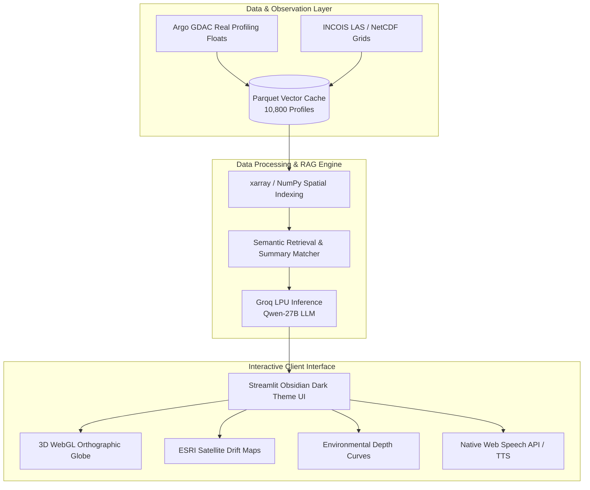

# FloatChat 3D 🌊⚡ — AI-Powered Ocean Intelligence Platform

> **Interactive 3D WebGL Visualization & Conversational AI for ARGO In-Situ Observations and Numerical Ocean Model Outputs**

[](https://tag-sih26-25qudjx3nnn4dqqhkcwwof.streamlit.app)
[](https://github.com/divyarajsingh2021-pixel/TAG-sih26)
[](https://www.python.org/)
[](https://console.groq.com/)
[](https://plotly.com/)
[](https://sih.gov.in/)

---

## 🏛️ Smart India Hackathon (SIH) 2026

* **Problem Statement ID:** `SIH26067` / `SIH26066`
* **Organization:** Ministry of Earth Sciences (MoES) / INCOIS (Indian National Centre for Ocean Information Services)
* **Themes:** Disaster Management · Space Technology
* **Team:** Outrage 1.0 *(Team ID: 194015)*
* **Institution:** Mohan Lal Sukhadia University (MLSU), Udaipur

---

## 🌟 Overview & Key Highlights

**FloatChat 3D** is an end-to-end cloud platform that eliminates the fragmentation between complex multi-dimensional numerical ocean models (NetCDF) and discrete in-situ ocean observations (ARGO profiling floats).

Users can explore **10,800+ real oceanographic profiles**, inspect 3D rotating earth globes, track float drift currents, and speak naturally to **Outrage**, an AI oceanographer powered by Groq's high-speed LPU inference engine.

```
┌────────────────────────────────────────────────────────────────────────┐
│                          FloatChat 3D Platform                         │
├───────────────────────────────────┬────────────────────────────────────┤
│   Left Panel: Conversational AI   │     Right Panel: Dual Viewport     │
│  - Outrage Ocean AI Agent         │  1. ARGO Analytics Dashboard       │
│  - Real-time Voice Mic (WebSpeech)│     • 6 Live Key Metric Cards      │
│  - Text-to-Speech Vocal Response  │     • 📅 Temporal SST Time Series  │
│  - Ocean Basin Scoping Selector   │     • 🌍 3D Interactive Globe      │
│  - RAG Semantic Query Engine      │     • 🌡️ 0-2000m Depth Stratification│
│  - Instant Pre-monsoon Analysis   │     • 🔬 T-S Water Mass Diagnostics│
│                                   │  2. Full ESRI Satellite Ocean Map  │
│                                   │     • 📍 Float Drift Trajectories  │
│                                   │     • 🔥 Temperature Heatmap Layer │
└───────────────────────────────────┴────────────────────────────────────┘
```

---

## 🚀 Live Working Prototype

👉 **Live Cloud URL:** [https://tag-sih26-25qudjx3nnn4dqqhkcwwof.streamlit.app](https://tag-sih26-25qudjx3nnn4dqqhkcwwof.streamlit.app)

### Try Asking Outrage:
* 🎤 *"What is the sea surface temperature in the Arabian Sea right now?"*
* 💬 *"Compare salinity between the Bay of Bengal and Arabian Sea."*
* 🎤 *"Show me how temperature changes at 500m depth."*
* 💬 *"Where is the thermocline layer located near the equator?"*

---

## ✨ Core Features & Technical Capabilities

### 1. 🌍 3D Interactive Rotating Globe (WebGL)
* Full 3D orthographic projection rendered client-side using Plotly WebGL.
* Interactive drag-to-rotate, pinch-to-zoom, and float hover telemetry (Float ID, SST, Salinity, GPS Coordinates).

### 2. 🛰️ High-Resolution Satellite & Trajectory Mapping
* Integrated ESRI World Imagery raster layers with interactive layer toggles (*Satellite, Ocean Bathymetry, OpenStreetMap, Dark Matter*).
* **Float Drift Physics Trajectories:** Visualizes the chronological displacement path of each float driven by geostrophic ocean currents.

### 3. 🌡️ Vertical Depth Profiles (0 to 2,000 meters)
* Continuous depth stratification curves displaying mean temperature and salinity with $\pm 1$ standard deviation confidence bands.
* **Thermocline Identification:** Visualizes the sharp thermal transition zone (100–200m depth) critical for monsoon dynamics and marine ecosystems.

### 4. 🔬 Temperature-Salinity (T-S) Water Mass Fingerprinting
* Diagnostic scatter plot classifying water masses (*Arabian Sea High Salinity Water vs. Bay of Bengal freshwater river runoff*).

### 5. ⚡ Voice-First Conversational RAG Architecture
* Native browser Web Speech API for low-latency voice input & automated audio answers.
* Powered by Groq's `qwen/qwen3.8-27b` model with contextual ARGO data retrieval.

---

## 🏗️ System Architecture



---

## 🛠️ Technology Stack

| Domain | Technologies Used |
| :--- | :--- |
| **Frontend Framework** | Streamlit 1.32+, Custom Obsidian Dark Theme CSS |
| **3D & 2D Visualization** | Plotly (WebGL, Scattergeo, Scattermapbox, Densitymapbox) |
| **AI / LLM Engine** | Groq API (`qwen/qwen3.8-27b` on custom LPUs) |
| **Data Engine & Analysis** | Python 3.11, xarray, NetCDF4, NumPy, Pandas, PyArrow Parquet, SciPy |
| **Voice Interface** | Native Browser Web Speech API & HTML5 SpeechSynthesis |
| **Deployment & CI/CD** | Streamlit Cloud, GitHub Actions, Docker, Railway/Heroku configs |

---

## 📂 Repository Structure

```
TAG-sih26/
├── app.py                     # Main Streamlit application & interactive UI
├── requirements.txt           # Clean dependencies for instant cloud boot
├── runtime.txt                # Python environment definition
├── .python-version            # Python version pinning
├── backend/
│   ├── rag_chain.py           # Lightweight RAG retrieval & Groq LLM chain
│   ├── router.py              # User query intent & geographic parser
│   └── visualizer.py          # 3D Globe, Satellite maps, and depth profile suite
├── data/
│   ├── processed/             # Cleaned 10,800 ARGO parquet database
│   └── faiss_index/           # Profile summaries and vector representations
├── scripts/
│   ├── download_argo.py       # ARGO GDAC ingestion script
│   └── build_index.py         # Data preprocessing and index builder
└── voice_component/
    └── index.html             # Native bidirectional Web Speech API component
```

---

## 💻 Local Setup & Quickstart

```bash
# 1. Clone repository
git clone https://github.com/divyarajsingh2021-pixel/TAG-sih26.git
cd TAG-sih26

# 2. Create virtual environment
python -m venv .venv
source .venv/bin/activate  # On Windows: .venv\Scripts\activate

# 3. Install requirements
pip install -r requirements.txt

# 4. Run application
streamlit run app.py
```

The platform will be live at `http://localhost:8501`.

---

## 👥 Team Outrage 1.0

* **Gaurav Suthar** *(Team Leader)*
* **Divyraj Singh Chundawat**
* **Gourav Meghwal**
* **Devraj Bunkar**
* **Aashish Giri Goswami**
* **Aditi Mandawat**

**Institution:** Mohan Lal Sukhadia University (MLSU), Udaipur, Rajasthan

---

## 📜 Acknowledgements & Data Citations

* **International Argo Program:** Argo Global Data Assembly Centre (GDAC) via SEANOE (DOI: `10.17882/42182`).
* **INCOIS:** Indian National Centre for Ocean Information Services, Ministry of Earth Sciences, Govt. of India.
* **Copernicus Marine Service:** Mercator Océan International Global Physics Reanalysis (GLORYS12V1).

---

<p align="center">
  <b>Built with ❤️ for Smart India Hackathon 2026</b><br>
  <i>Democratizing Ocean Science through Artificial Intelligence & 3D Web Visualizations</i>
</p>
